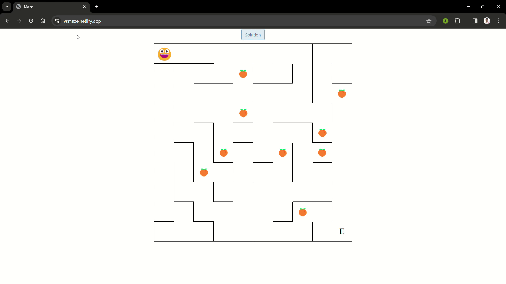

# Maze Game

Welcome to the Maze Game! This project is a simple maze game where players navigate through a randomly generated maze to reach the end.

## Table of Contents

- [Demo](#demo)
- [Features](#features)
- [Getting Started](#getting-started)
- [Usage](#usage)
- [Controls](#controls)
- [Contributing](#contributing)
- [License](#license)

## Demo

# [site](https://vsmaze.netlify.app/)


## Features

- Dynamic generation of random mazes.
- Interactive navigation using arrow keys or on-screen control buttons.
- Ability to find and display the solution path.
- Responsive design for mobile and desktop devices.

## Getting Started

To get started with the Maze Game, follow these steps:

1. Clone the repository:

   ```bash
   git clone https://github.com/shrut-vanpariya/maze-game.git
   ```

2. Navigate to the project directory:

   ```bash
   cd maze-game
   ```

3. Open `index.html` in your web browser to play the game.

## Usage

- Use the arrow keys (or on-screen control buttons) to navigate through the maze.
- Reach the end of the maze to complete the game.
- Click the "Solution" button to visualize the solution path.

## Controls

- Arrow Keys:
  - Up Arrow: Move Up
  - Down Arrow: Move Down
  - Left Arrow: Move Left
  - Right Arrow: Move Right

- On-screen Control Buttons:
  - Click the directional buttons to navigate through the maze.

## Contributing

Contributions are welcome! Feel free to submit bug reports, feature requests, or pull requests to help improve the Maze Game.

## License

This project is licensed under the [MIT License](LICENSE).
